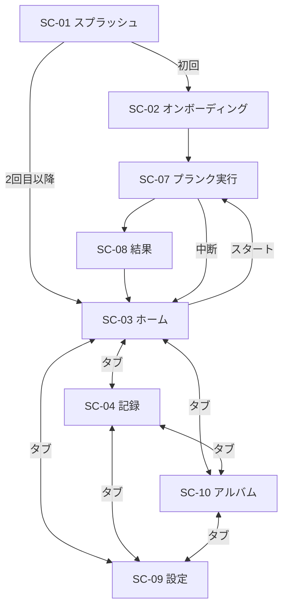
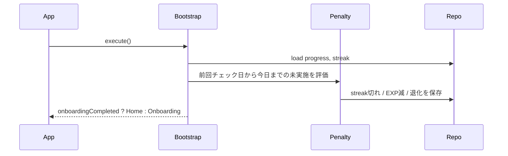
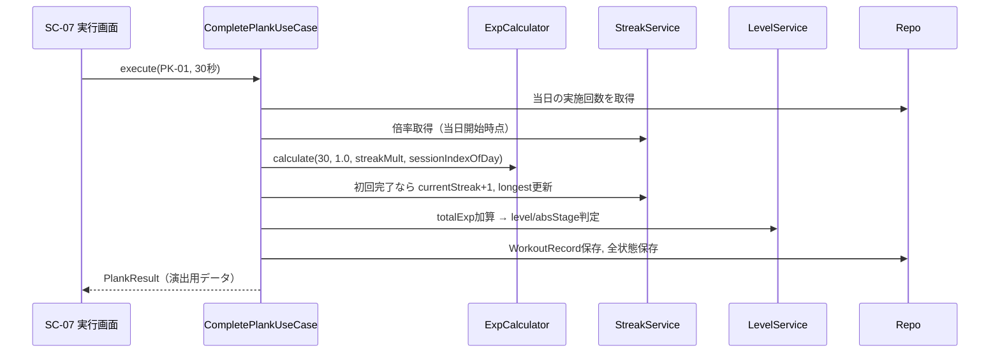

# 🏗️ 基本設計（軽量） — ふっきん MVP

**対象:** MVP版（プロトタイプ）  
**準拠:** [`01-kikaku.md`](01-kikaku.md) v0.7 / [`02-youken.md`](02-youken.md) v1.1 / [`03-phase.md`](03-phase.md) v1.0  
**作成日:** 2026-06-10  
**バージョン:** 1.0（MVP）

---

## 1. システム構成（論理）

MVP は **クライアント単体アプリ** とし、バックエンド・課金・広告は持たない。すべての状態は端末ローカルに保存する。

```
┌─────────────────────────────────────────────────────────┐
│                    ふっきん MVP App                       │
│  ┌─────────────┐  ┌─────────────┐  ┌─────────────────┐ │
│  │ Presentation │  │ Application │  │     Domain      │ │
│  │  (UI/画面)   │→ │  (ユースケース)│→ │ (ゲームロジック)  │ │
│  └─────────────┘  └─────────────┘  └─────────────────┘ │
│         │                 │                  │          │
│         └─────────────────┴──────────────────┘          │
│                           │                             │
│                  ┌────────▼────────┐                    │
│                  │  Infrastructure │                    │
│                  │ LocalStorage    │                    │
│                  │ MasterData      │                    │
│                  │ Notification    │（任意）           │
│                  └─────────────────┘                    │
└─────────────────────────────────────────────────────────┘
```

| 層 | 役割 |
|----|------|
| **Presentation** | 画面・Widget、演出（ストリーク +1、進化）、ナビゲーション |
| **Application** | プランク完了、日次ペナルティ、オンボーディング完了などのユースケース orchestration |
| **Domain** | EXP 計算、ストリーク判定、レベル/退化、マイルストーン判定（純粋ロジック） |
| **Infrastructure** | SQLite / SharedPreferences、種目マスタ JSON、ローカル通知 |

### 1.1 技術スタック（MVP）

| 項目 | 選定（案） | 備考 |
|------|------------|------|
| クライアント | **Flutter（Dart）** | クロスプラットフォーム。iOS 先行後に Android 展開しやすい |
| 状態管理 | Riverpod または Bloc | 画面間でストリーク・キャラ状態を共有 |
| ローカル DB | drift（SQLite）または Hive | 実施履歴・進捗の永続化 |
| 軽量設定 | shared_preferences | オンボーディング完了フラグ等 |
| キャラ演出 | Lottie または静止画スプライト | MVP は差分少なめ（腹筋5段階） |
| 通知 | flutter_local_notifications | PL-20（余力があれば） |
| 分析 | firebase_analytics（任意） | β 前でもイベント計測開始可 |
| バックエンド | **なし** | v1.0 で Firebase 等を検討 |

---

## 2. モジュール構成

```
lib/
├── main.dart
├── app/                    # ルーティング、テーマ、DI
├── presentation/           # 画面・Widget
│   ├── splash/
│   ├── onboarding/
│   ├── home/
│   ├── calendar/
│   ├── album/
│   ├── plank_select/
│   ├── duration_setting/
│   ├── plank_session/
│   ├── result/
│   └── settings/
├── application/            # ユースケース
│   ├── complete_plank_usecase.dart
│   ├── apply_daily_penalty_usecase.dart
│   └── bootstrap_usecase.dart
├── domain/
│   ├── models/             # UserProgress, Streak, WorkoutRecord...
│   ├── services/
│   │   ├── exp_calculator.dart
│   │   ├── streak_service.dart
│   │   ├── level_service.dart
│   │   └── penalty_service.dart
│   └── repositories/       # 抽象インターフェース
├── infrastructure/
│   ├── local/              # DB 実装
│   ├── master/             # 種目・定数マスタ
│   └── notification/
└── assets/
    ├── character/          # 腹筋ステージ別画像
    ├── lottie/
    └── master/plank_types.json
```

### 2.1 ドメインサービス責務

| サービス | 責務 |
|----------|------|
| `ExpCalculator` | `基本EXP × 難易度倍率 × ストリーク倍率`、再実施ボーナス段階加算（+5% ずつ、+15% キャップ）、日次上限 |
| `StreakService` | ストリーク +1、途切れ判定、倍率取得、最長記録更新 |
| `LevelService` | 累計 EXP → レベル、腹筋ステージ判定 |
| `PenaltyService` | 未実施日数に応じた EXP 減少・退化 |
| `MilestoneService` | 3/7/14/30日（MVP 必須）の到達判定 |
| `PlankTimer` | カウントダウン、一時停止、バックグラウンド経過時間の補正 |

---

## 3. 画面一覧と遷移（MVP）

**UI/UXモック:** `01-design/screen/` — ホーム画面確定（2026-06-11）。詳細は [`02-youken.md`](02-youken.md) §3.3.1

| ID | 画面 | 目的 | 主要要素 | 遷移発火 |
|----|------|------|----------|----------|
| SC-01 | スプラッシュ | 起動・データ読込 | ロゴ、ローディング | 初回→SC-02 / 2回目以降→SC-03 |
| SC-02 | オンボーディング | 初回導線 | キャラ紹介、秒数＝EXP 説明、秒数設定、初回プランクへ | 完了→SC-08→SC-03 |
| SC-03 | ホーム（home タブ） | 日常の起点・実施準備 | レベルバー、ストリーク・倍率、キャラビュー／種目ビュー、種目カルーセル、秒数スライダー、EXP 見込み、スタート | スタート→SC-07。タブ→SC-04 / SC-10 / SC-09 |
| SC-04 | 記録（記録タブ） | 履歴・振り返り | 月間カレンダー、実施マーク、最長ストリーク、称号一覧 | タブ→SC-03 / SC-10 / SC-09 |
| SC-05 | ~~種目選択~~ | — | **SC-03 種目ビューに統合** | — |
| SC-06 | ~~秒数設定~~ | — | **SC-03 種目ビューに統合** | — |
| SC-07 | プランク実行 | 計測 | タイマー、キャラ同期、一時停止、応援セリフ | 完了→SC-08、中断→SC-03（確認ダイアログ） |
| SC-08 | 結果 | 報酬 | ストリーク+1演出、EXP 内訳、マイルストーン、レベルアップ、進化 | 閉じる→SC-03 |
| SC-09 | 設定（設定タブ） | 設定 | デフォルト秒数、通知 ON/OFF（任意）、データリセット | タブ→SC-03 / SC-04 / SC-10 |
| SC-10 | アルバム（アルバムタブ） | キャラ成長の振り返り | 腹筋ステージ 0〜4 の全身イラスト、到達済み／未到達表示、現在ステージのハイライト、各ステージの必要累計 EXP | タブ→SC-03 / SC-04 / SC-09 |

**MVP で実装しない画面:** Pro 誘導、動画広告、マイルーティン、詳細レポート

### 3.1 遷移図



### 3.2 画面別 UI 要件（MVP）

#### SC-03 ホーム（最重要）

モック: `01-design/screen/スクリーンショット 2026-06-11 6.34.*.png`

| 領域 | 要素 | 仕様 |
|------|------|------|
| ヘッダー | レベル進捗バー | `Lv N` + `現在EXP / 次レベルまでEXP` + プログレスバー |
| ヘッダー | ストリーク・倍率 | `ストリーク○日` `倍率○.○`（コンパクト1行） |
| パネルA（キャラビュー） | キャラ | 腹筋ステージ連動の全身イラスト。名前・`Lv N` を下部表示 |
| パネルB（種目ビュー） | 種目カルーセル | 「種目を選ぶ」、左右スワイプ、種目名・難易度星・倍率バッジ |
| パネルB（種目ビュー） | 秒数・EXP | 目標秒数スライダー（10〜120秒）、完了時 EXP 見込み（リアルタイム） |
| パネルB（種目ビュー） | CTA | `▷ スタート` → SC-07 |
| パネル切替 | 横スワイプ | キャラビュー ⇔ 種目ビューを左右矢印 or スワイプで切替 |
| 下部タブ | ナビゲーション | home（現在地）/ 記録（SC-04）/ アルバム（SC-10）/ 設定（SC-09） |

**SC-04 記録タブに移管:** 最長ストリーク、次マイルストーン、今日の達成状態の詳細表示。

#### SC-10 アルバム

| 領域 | 要素 | 仕様 |
|------|------|------|
| ヘッダー | タイトル・現在ステージ | `アルバム` + `現在: ステージ N`（`absStage` 連動） |
| メイン | ステージ一覧 | 腹筋ステージ 0〜4 を横スワイプ or サムネイル列で表示。到達済みは全身イラスト、未到達はシルエット＋必要累計 EXP |
| メイン | 現在位置 | ユーザーの現在ステージを枠・バッジでハイライト |
| メイン | 遷移プレビュー | 左右スワイプでステージ間の見た目変化（進化／退化の段階）を閲覧。タップで拡大表示（任意） |
| 下部タブ | ナビゲーション | home（SC-03）/ 記録（SC-04）/ アルバム（現在地）/ 設定（SC-09） |

**データソース:** `UserProgress.absStage` とレベル閾値（§5.3）。追加永続化は不要（進捗から導出）。

#### SC-08 結果（演出順序）

```
1. ストリーク +1 演出（最優先・フルスクリーン）
2. マイルストーン到達時の追加演出（該当時のみ）
3. EXP 内訳（基本 / 難易度 / ストリーク）
4. レベルアップ → 腹筋進化演出（該当時のみ）
5. 「ホームへ」ボタン
```

---

## 4. インターフェース（I/F）定義

MVP はオフライン単体のため、**アプリ内リポジトリ・ユースケース I/F** を定義する。

### 4.1 リポジトリ

| I/F | メソッド | 入力 | 出力 | 備考 |
|-----|----------|------|------|------|
| `UserProgressRepository` | `get()` | — | `UserProgress` | 累計EXP、レベル、腹筋ステージ |
| | `save(progress)` | `UserProgress` | `void` | |
| `StreakRepository` | `get()` | — | `StreakState` | 現在・最長・最終実施日 |
| | `save(state)` | `StreakState` | `void` | |
| `WorkoutRepository` | `add(record)` | `WorkoutRecord` | `void` | 実施履歴追加 |
| | `getByDate(date)` | `Date` | `List<WorkoutRecord>` | 同日複数回判定 |
| | `getCalendarMonth(year, month)` | 年月 | `Map<date, bool>` | カレンダー表示 |
| `MilestoneRepository` | `getAchieved()` | — | `List<Milestone>` | 達成済み称号 |
| | `add(milestone)` | `Milestone` | `void` | |
| `SettingsRepository` | `get()` / `save()` | `AppSettings` | — | デフォルト秒数、通知設定 |
| `PlankMasterRepository` | `getAll()` | — | `List<PlankType>` | MVP は2種のみ返す |

### 4.2 ユースケース

| I/F | メソッド | 入力 | 出力 | 備考 |
|-----|----------|------|------|------|
| `BootstrapUseCase` | `execute()` | — | `BootstrapResult` | 起動時：日次ペナルティ適用、遷移先判定 |
| `CompletePlankUseCase` | `execute()` | `plankTypeId`, `targetSeconds` | `PlankResult` | EXP付与、ストリーク更新、マイルストーン、進化 |
| `ApplyDailyPenaltyUseCase` | `execute()` | `today` | `PenaltyResult` | 未実施日のストリーク切れ・EXP減・退化 |
| `PreviewExpUseCase` | `execute()` | `plankTypeId`, `targetSeconds` | `ExpPreview` | 秒数設定画面の見込み表示 |

### 4.3 ドメイン I/F（純粋関数）

| I/F | 入力 | 出力 |
|-----|------|------|
| `ExpCalculator.calculate` | `baseExp`, `difficultyMultiplier`, `streakMultiplier`, `sessionIndexOfDay` | `int`（獲得EXP） |
| `StreakService.getMultiplier` | `currentStreakDays` | `double`（1.0〜1.5） |
| `LevelService.getAbsStage` | `totalExp` | `int`（0〜4） |
| `PenaltyService.calculate` | `daysMissed`, `lastWorkoutBaseExp`, `currentProgress` | `PenaltyResult` |

---

## 5. データモデル（MVP）

### 5.1 エンティティ

```dart
// ユーザー進捗
UserProgress {
  totalExp: int
  level: int
  absStage: int          // 0〜4
  lastPenaltyCheckDate: Date  // 日次ペナルティ済み日
}

// ストリーク
StreakState {
  currentStreak: int
  longestStreak: int
  lastWorkoutDate: Date?     // 最終実施日（カレンダー日）
  todayCompleted: bool       // 当日完了済みフラグ
}

// 実施記録
WorkoutRecord {
  id: string
  date: Date
  plankTypeId: string      // PK-01, PK-02
  targetSeconds: int
  earnedExp: int
  completedAt: DateTime
  sessionIndexOfDay: int   // 同日何回目か（1, 2, ...）
}

// マイルストーン
Milestone {
  days: int                // 3, 7, 14, 30
  title: string
  achievedAt: DateTime
}

// 設定
AppSettings {
  onboardingCompleted: bool
  defaultSeconds: int
  notificationEnabled: bool
  reminderHour: int?       // 17〜23 想定
}
```

### 5.2 マスタデータ（`plank_types.json`）

MVP では **PK-01, PK-02 のみ** を `enabled: true` とする。

```json
{
  "id": "PK-01",
  "name": "ベーシックプランク",
  "difficulty": 1,
  "expMultiplier": 1.0,
  "defaultSeconds": 30,
  "enabledInMvp": true,
  "poseAssetId": "basic_plank"
}
```

### 5.3 ゲーム定数（`game_constants.dart` または JSON）

| 定数 | MVP 値 |
|------|--------|
| 秒数下限 / 上限 | 10 / 120 |
| 再実施ボーナス加算率（step） | 0.05（2回目以降、回数ごとに +5%） |
| 再実施ボーナス上限倍率（cap） | 1.15（+15%。4回目以降は固定。Remote Config で調整可） |
| 1日 EXP 上限 | 150 |
| ストリーク倍率テーブル | 企画書どおり（1.0〜1.5） |
| レベル閾値 | 150 / 400 / 800 / 1400 |
| ペナルティ：2日目 | `max(10, floor(lastBaseExp × 0.5))` |
| ペナルティ：3日目以降 | `lastBaseExp` / 日 |
| マイルストーン日数 | 3, 7, 14, 30（MVP 必須） |

### 5.4 MVP 仮定（未決事項の暫定）

| 項目 | MVP での仮定 |
|------|--------------|
| 途中終了 | **0 EXP**（設定秒数未達は完了扱いにしない） |
| ストリーク締切 | **0:00**（端末ローカルタイムゾーン） |
| プラットフォーム | **iOS 先行**（TestFlight） |
| 一時停止 | 許可。再開でタイマー続行。完了は設定秒数到達時のみ |

---

## 6. データフロー（主要ユースケース）

### 6.1 アプリ起動（Bootstrap）



**処理ルール**

1. `lastPenaltyCheckDate` より後の各カレンダー日について、プランク未実施ならペナルティを1日分適用
2. 最終実施日の翌日を過ぎて未実施ならストリークを 0 にリセット
3. 今日が未実施なら `todayCompleted = false`

### 6.2 プランク完了



**PlankResult の内容**

- `earnedExp`, `expBreakdown`（基本/難易度/ストリーク）
- `streakAfter`, `streakIncreased`
- `milestoneReached?`（該当時）
- `levelUp?`, `absStageChanged?`

### 6.3 日次ペナルティ（未実施）

| 経過日数 | ストリーク | EXP | 腹筋 |
|----------|------------|-----|------|
| 1日サボり（当日中） | 維持（まだ途切れない） | 変化なし | 変化なし |
| 最終実施の翌日を過ぎた | **0 にリセット** | 2日目終了時に減少開始 | 閾値下回れば退化 |
| 復帰後 | 1から再開 | 通常付与 | 再蓄積で進化 |

---

## 7. 非機能要件（MVP 数値の確定）

| 区分 | 数値/方針 |
|------|-----------|
| ホーム表示 | 起動から **2秒以内**（スプラッシュ除く） |
| タイマー精度 | 誤差 **±1秒以内**。バックグラウンド復帰時は `elapsed` で補正 |
| オフライン | 全機能がネットワークなしで動作 |
| データ永続化 | プランク完了直後に **同期的に保存**（完了演出前） |
| クラッシュ耐性 | 実行中の `targetSeconds`, `elapsed`, `plankTypeId` を一時保存し、異常終了時は再開 or 破棄を選択 |
| 対応 OS | iOS **15+**（MVP 先行） |
| アプリサイズ | 目安 **50MB以下**（アセット込み） |
| バッテリー | プランク中のみ画面オン維持（Wakelock） |

---

## 8. 環境・依存関係（MVP）

| 区分 | 内容 |
|------|------|
| 開発 | Flutter 3.x / Dart 3.x、Xcode 15+、CocoaPods |
| CI（任意） | `flutter test`、`flutter analyze`、iOS ビルド |
| 配信 | TestFlight（内部テスト） |
| 主要パッケージ（案） | `riverpod`, `drift` or `hive`, `shared_preferences`, `flutter_local_notifications`, `lottie` |
| 外部サービス | なし（Firebase Analytics は任意） |

---

## 9. フェーズ整合（計画書との対応）

| 項目 | MVP | β | 正式版 |
|------|-----|-----|--------|
| 画面数 | 10画面（アルバムタブ含む） | +種目拡張UI | +Pro/広告/ルーティン |
| プランク種目 | 2種 | 5〜9種 | 9種＋Proロック |
| ストレージ | ローカルのみ | ローカル | +クラウド（Pro） |
| マイルストーン | 3/7/14/30 | +60/100 | 同左 |
| 通知 | 任意 | 必須 | 必須 |
| 収益化 | なし | なし | サブスク＋動画広告 |

**MVP DoD との対応:** 本設計の SC-01〜10、CompletePlankUseCase、ApplyDailyPenaltyUseCase、ローカル Repository で [`03-phase.md`](03-phase.md) の DoD を満たす。

---

## 10. テスト方針（MVP）

| 種別 | 対象 | 例 |
|------|------|-----|
| 単体テスト | Domain | ExpCalculator、StreakService、PenaltyService の境界値 |
| 単体テスト | 日付跨ぎ | 23:59完了→0:00起動でストリーク維持/切れ |
| Widget テスト | SC-03, SC-08 | ストリーク表示、EXP 内訳表示 |
| 手動テスト | SC-07 | バックグラウンド・電話割り込み時のタイマー |
| 手動テスト | 7日連続 | マイルストーン演出、倍率変化 |

---

## 11. 参照

| 文書 | 用途 |
|------|------|
| [`01-kikaku.md`](01-kikaku.md) | UX・ゲーム数値・ストリーク設計 |
| [`02-youken.md`](02-youken.md) | 機能要件 ID・非機能要件 |
| [`03-phase.md`](03-phase.md) | MVP スコープ・DoD・スケジュール |
| [`05-detailed-design.md`](05-detailed-design.md) | 実装タスク・API 詳細（今後作成） |
| `01-design/screen/` | 画面モック（今後作成） |

---

*最終更新: 2026-06-11 / バージョン: 1.1（アルバムタブ追加）*
